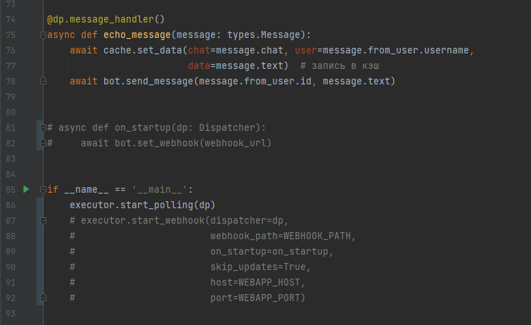

# Внутренний проект компаний **Y_lab**

## Для запуска проекта, выполните следующие шаги:

1. Создайте своего собтсвенного бота https://telegram.me/BotFather

2. Создайте виртуальное окружение:
```bash
python -m venv env
```

3. Войдите в виртуальное окружение:
```bash
source env/bin/activate
```

4. Установите зависимости:
```bash
pip install -r requirements.txt
```

5. Скопируйте файл с переменными окружения:
```bash
cp .env.example .env
```

6. В файле `.env` установите в переменную `BOT_TOKEN`, токен своего созданного бота.
```
BOT_TOKEN=...
```

7. Если хотите запустить с использованием polling
- В файле `bot.py` измените код в конце на:



8. Если хотите запустить с использованием webhook на ngrok:
- установите ngrok глобально;
- запустите на порте 8000:
```bash
ngrok http 8000
```
- в переменные окружения скопируйте адрес хоста ngrok из консоли:
```bash
WEBHOOK_HOST= 'https://<ngrok_host>' 
```
- в случае если в bot.py закомментирован webhook - раскомментируйте, polling - закомментируйте

## Сборка образов и запуск контейнеров
Попросите у команды файл `credentials.json`.
netstat -pna | grep 6379

В корне репозитория выполните команду:
```bash
docker-compose up --build -d
```
При первом запуске данный процесс может занять несколько минут.

### Остановка контейнеров
Выполните команду:
```bash
docker-compose stop
```
### Настройка commit-hook
Установите pre-commit вне виртуального окружения:
```bash
pip install pre-commit
```
